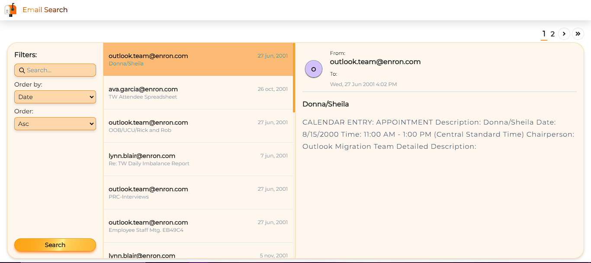
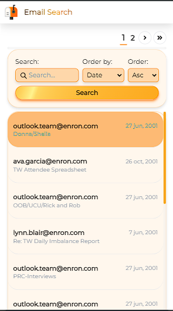

# Email Search

Es una aplicación creada para la búsqueda por palabras de una gran catidad de correos electrónicos, en este caso de la corporacion ENRON.

La aplicación consiste en un monorepo, conformado por el backend creado con Go, usando Chi Router como enrutador, el frontend con VUE3, Tailwind y Typescript y finalmente se hace uso de ZincSearch como base de datos, gracias a este último podemos hacer búsquedas extremadamente rápidas, dentro de más de 517mil correos electrónicos.

En la interfaz gráfica, se puede buscar por conincidencia de palabras y ordenar por alguna propiedad elegida de forma ascendente o descendente, completamente responsiva.

## Vista previa de la aplicación

Vista de la aplicación en modo Desktop

 | 

Vista de la aplicación en modo Mobile

## Pasos para correr esta aplicación de forma local

- Descargar la base de datos de correos de Enron Corp, en el siguiente enlace:
  http://www.cs.cmu.edu/~enron/enron_mail_20110402.tgz

- Descomprimir el archivo descargado y agregarlo al directorio emails-indexer

- Cambiar el nombre del directorio a data

- Descargar zincSearch en el siguiente enlace:
  https://github.com/zincsearch/zincsearch/releases

- Seguir las instrucciones de instalación en la documentación en el siguiente enlace:
  https://zincsearch-docs.zinc.dev/installation/

- Al tener corriendo el zincSearch en el http://localhost:4080

- Abrir otra terminal

- cd emails-indexer

- Crear un archivo .env y agregar las siguientes variables de entorno:

  - ZS_BASE_API_URL=http://localhost:4080/
  - ZS_USER=admin
  - ZS_PASSWORD=Complexpass#123
  - ZS_INDEX=emails

- go run . (Con esto indexaremos la base de datos en la herramienta ZincSearch y estará disponible para ser usada en nuestro backend)

- Abrir otra terminal

- cd email-api

- Crear un archivo .env y agregar las siguientes variables de entorno:

  - PORT=8080
  - ZS_BASE_API_URL=http://localhost:4080/
  - ZS_INDEX=emails
  - ZS_USER=admin
  - ZS_PASSWORD=Complexpass#123

- go run . (Con esto tendremos corriendo nuestro backend)

- Abrir otra terminal

- cd email-client

- Crear un archivo .env y agregar la siguiente variable de entorno:

  - VITE_API_URL=http://localhost:8080/

- npm install

- npm run dev

- Abrir en el navegador http://localhost:5173
